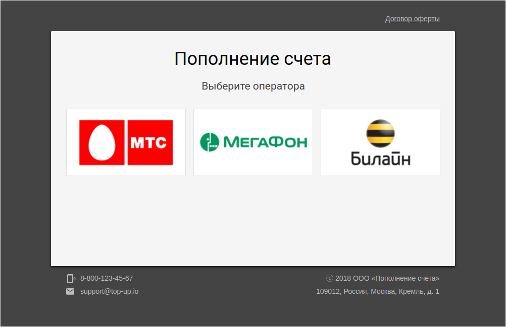

# Shakuro Top Up Application Design

## The Original Task

**Терминал оплаты услуг сотовой связи**

Разработать (сверстать и реализовать клиентскую логику) интерфейс приложения для
терминала предоставляющего сервис пополнения баланса сотовых операторов.

Приложение должно иметь следующие экраны/основные элементы ввода и управления:

**1. Главный экран**
- Список обслуживаемых операторов связи: МТС, Билайн, Мегафон (предусмотреть возможность большого количества операторов). 
- При клике на любом операторе - переход на экран пополнения.
 
**2. Форма пополнения баланса**
- Идентификатор выбранного оператора связи
- Поле ввода номера телефона (с маской и валидацией)
- Поле ввода суммы пополнения в руб (с маской и валидацией, мин возможная сумма - 1 руб, максимальная - 1000 руб)
- Кнопка пополнить - при нажатии ждем ответ от сервера, показываем сообщение об успехе или ошибке. В случае успеха возвращаем на главный экран. Успех и ошибку реализовать случайным образом.

## A Solution

In order to implement the desired application, the design stage was performed.

Material design was used as a base design system to drive the overall design decisions.

The design itself was performed in minimalistic manner with usability and UX in mind.

The screen navigation logic is a classic wizard pattern, which drives user through
steps required to perform the mobile account top-up.

The suggested operator logotypes were proportionally resized
to make them look similar in size.

All images were prepared to be used with @2x (retina) displays,
however, vector graphics is preferred to render all screen elements.

All element sizes are proportional. The golden ratio was used to define some proportions.

All elements are perfectly aligned and positioned, so the design
should be considered pixel-perfect. However, some slight modifications
are expected during implementation, especially when it comes to
ready-made Material Design components usage.

### Main screen (operator selection)

The main application screen allows user to select the mobile operator
to be used for account top-up.

The list of operators could be ordered by the popularity.

The list of operators could be extended later on by adding more operators.

### Form screen

The form screen allows user to input payment details.

The operator, selected on main screen is pre-selected automatically when
screen is first displayed. The operator logo is rendered next to the drop-down
box in order to make the selection more obvious and to prevent possible errors.

The operator could be changed by selecting the one from the drop-down menu.

Phone number should be entered in international format, the auto-formatting
should be used during the input.
A [libphonenumber](https://github.com/googlei18n/libphonenumber)
library by Google is suggested for phone number input implementation.

### Loading screen

All input elements should be disabled during the form processing
so the user can't change the pending input data.

Loading animation should be displayed instead of the submit button.

### Error screen

Processing error is displayed right near the form, so the user
could change the input data or try to re-submit the form again.

Error text should be clear and concise and include the suggested actions
required for user to take in order to fix the problem.

### Success screen

Payment success screen contains the virtual receipt, which is associated with
the successful payment in offline world.

The button allows to return to the main screen in order to make another payment.

# Author

**Slava Fomin II**

- [slava@fomin.io](mailto:slava@fomin.io)
- [http://slava.fomin.io](http://slava.fomin.io)
